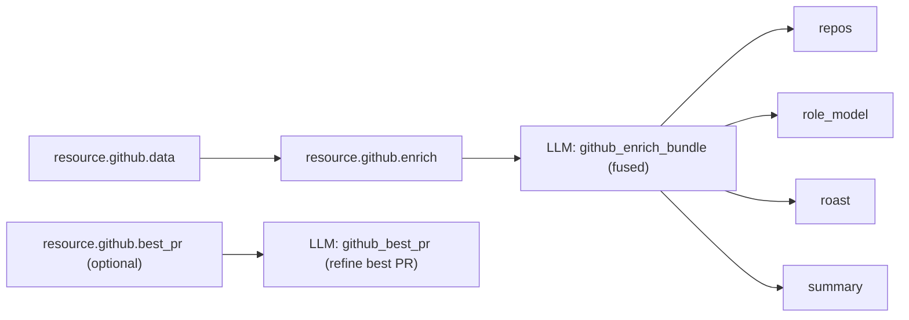
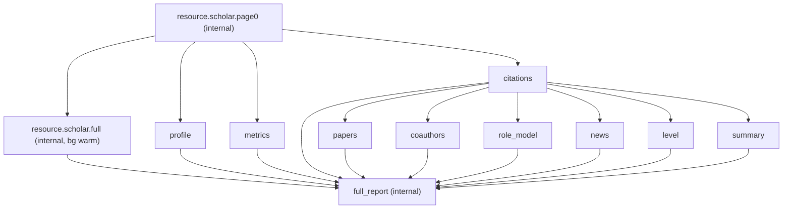
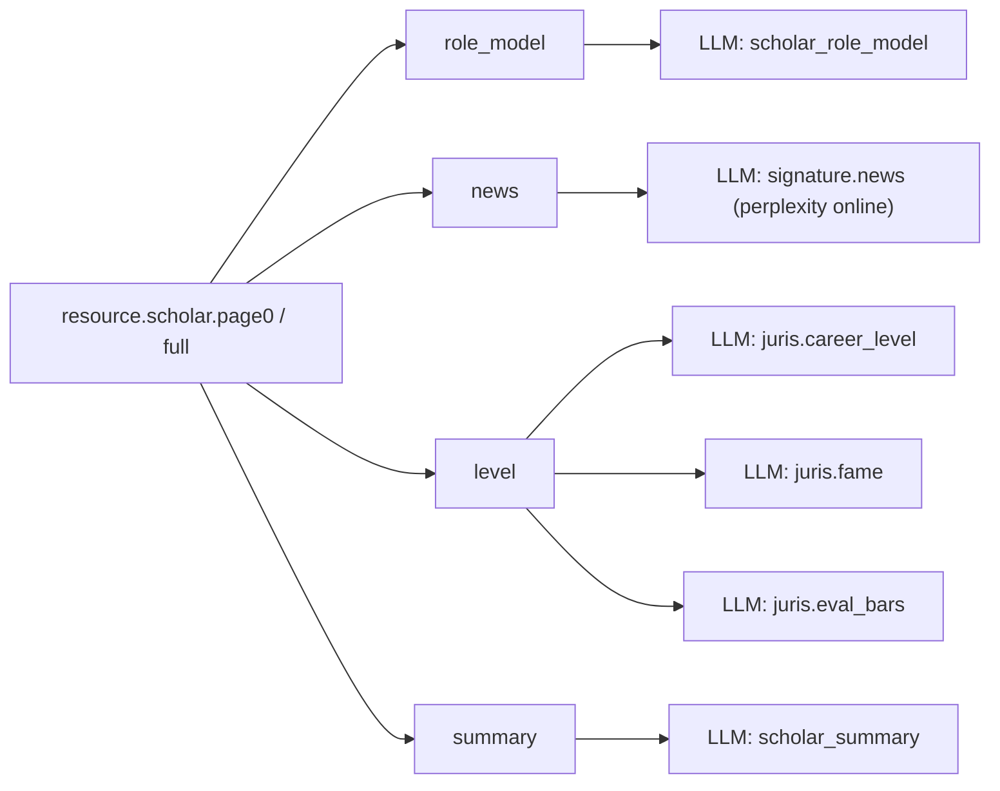
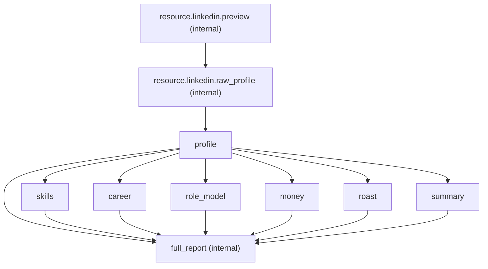
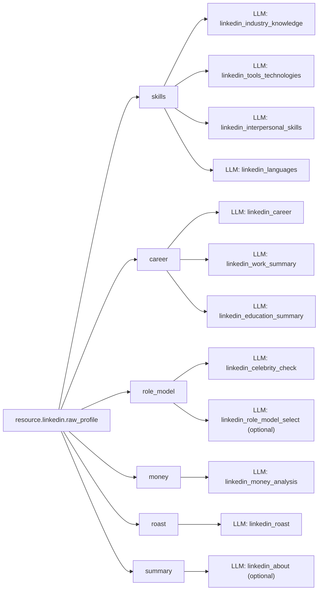

# /api/analyze：GitHub / Scholar / LinkedIn 分析链路全景（DAG + 外部请求数 + LLM 依赖图）

本文面向“准备全量重构”的工程梳理：把 **统一分析入口 `/api/analyze`** 在 **GitHub / Scholar / LinkedIn** 三个 source 下的执行拓扑、外部请求清单（次数/范围/目的）、以及 LLM 调用依赖关系一次讲清楚。

> 代码入口（建议先看）：  
> - 统一 API：`server/analyze/api.py`  
> - DAG 定义：`server/analyze/rules.py`（`CARD_MATRIX` / `build_plan`）  
> - 执行器：`server/analyze/pipeline.py`（`PipelineExecutor.execute_card()`）  
> - Scheduler：`server/tasks/scheduler.py`（并发组、deadline、retry、quality gate）  
> - 资源抓取：`server/analyze/resources/{github,scholar,linkedin}.py`

---

## 0. 统一分析链路（所有 source 通用）

### 0.1 Job / Card / Artifact / Event
- **Job**：一次分析任务（`jobs` 表），由 `/api/analyze` 创建。
- **Card**：可执行单元（`job_cards` 表），包括：
  - **internal cards**：`resource.*` + `full_report`（前端不渲染；多用于抓取/聚合/缓存）
  - **business cards**：如 `profile/activity/repos/summary/...`（前端只渲染 `internal=false`）
- **Artifact**：大对象/中间结果（`artifacts` 表），例如 `resource.github.data`、`resource.linkedin.raw_profile`。
- **Event**：SSE 可回放事件流（`job_events` 表）：`card.progress/card.append/card.delta/card.completed/...`

### 0.2 执行形态（单机本地优先）
- API 进程内启动 scheduler 执行 cards（不再区分 external runner 拓扑）。
- 主存储为本机 SQLite（jobs/events + analysis caches）。
- 远程 Postgres（可选）仅用于 outbox 异步备份/冷启动读回，不在在线请求关键路径。

### 0.2.1 “首屏速度”的真实决定因素（现在主要是外部 API）
SSE 仍然是 **DB 事件溯源（job_events）+ 快照（job_cards.output）**，但由于主库是本机 SQLite，DB RTT 基本不再是瓶颈。
首屏/长尾主要由外部依赖决定：GitHub API、Crawlbase/抓取、Apify、LLM 等。

### 0.3 Scheduler 关键机制（影响“完整性/速度”）
1) **并发组（concurrency_group）**  
默认映射来自 `rules.build_plan()`：
- `resource.*`：
  - GitHub → `github_api`
  - Scholar → `crawlbase`
  - LinkedIn → `apify`
- AI 类业务卡（`repos/role_model/summary/...`）→ `llm`

默认并发上限（可用 `DINQ_ANALYZE_CONCURRENCY_GROUP_LIMITS` 覆盖）见 `server/tasks/scheduler.py`：
- `llm`: `min(4, max_workers)`
- `crawlbase`: `min(2, max_workers)`
- `apify`: `1`

2) **软截止（deadline_ms）**（⚠️很重要）  
`rules._default_deadline_ms()`：默认仅对“enrich 卡”生效，当前默认 `10_000ms`。  
Scheduler 判断口径：`job.created_at` 到“该卡开始执行时刻”的 age；如果 **age > deadline_ms**，该卡将直接用 deterministic fallback 完成（不再跑 LLM）。  
这会显著影响 LinkedIn（raw_profile 常 > 10s）以及 Scholar/GitHub 的长尾完整性。

3) **重试（attempts）**
- 资源卡默认最多 `DINQ_ANALYZE_MAX_RETRIES_RESOURCE`（默认 2）
- AI 卡默认最多 `DINQ_ANALYZE_MAX_RETRIES_AI`（默认 2）
- base 卡默认最多 `DINQ_ANALYZE_MAX_RETRIES_BASE`（默认 1）

4) **质量门禁（Quality Gate）**
- 业务卡输出必须通过 `validate_card_output()`；否则触发 retry / 最终 fallback（避免静默 `{}` / `null`）。
- cache-hit 也走同一套门禁（避免“缓存里已坏结果”长期污染）。

---

## 1. Preflight：模糊输入（freeform）候选解析（会额外产生外部请求）

`/api/analyze` 在以下条件下会触发 **候选解析**（先不创建 job，返回 `needs_confirmation=true`）：
- `source in (scholar, github, linkedin)` 且输入被判定为 ambiguous（`server/analyze/freeform.py:is_ambiguous_input`）
- 默认 `options.allow_ambiguous=false`（即自动 canonicalize）

候选解析外部请求（每次请求的目的）：
- GitHub：`GET https://api.github.com/search/users?q=<query>&per_page=<limit>`  
  目的：把“名字/片段”解析为稳定的 `login`。
- LinkedIn：Tavily Search（若 `TAVILY_API_KEY` 配置）  
  目的：把“人名”解析为稳定的 `linkedin.com/in/...` profile URL。
- Scholar：
  - 优先 Tavily Search（若 `TAVILY_API_KEY` 配置）：`site:scholar.google.com/citations "<name>"`  
    目的：把“人名”解析为稳定的 `scholar_id`（`?user=`）。
  - 否则走 Scholar fetcher 的 author search（抓取 Scholar 搜索页）  

候选结果支持 DB TTL 缓存：`AnalysisArtifactCache(kind="freeform_candidates")`。

---

## 2. GitHub：执行拓扑 + 外部请求数 + LLM 依赖

### 2.1 Card DAG（GitHub）

```mermaid
flowchart TD
  %% internal resources
  RProfile["resource.github.profile (internal)"] --> Profile["profile"]
  RProfile --> RPreview["resource.github.preview (internal)"]
  RPreview -. card.append(top_projects) .-> Repos["repos"]
  RPreview --> RData["resource.github.data (internal)"]
  RData --> Activity["activity"]
  RData --> REnrich["resource.github.enrich (internal)"]

  %% derived UI cards from enrich
  REnrich --> Repos
  REnrich --> RoleModel["role_model"]
  REnrich --> Roast["roast"]
  REnrich --> Summary["summary"]

  %% optional background refinement for best PR
  RData --> RBestPR["resource.github.best_pr (optional internal)"]
  RBestPR -. updates .-> Repos

  %% aggregator (internal)
  Profile --> Full["full_report (internal)"]
  Activity --> Full
  Repos --> Full
  RoleModel --> Full
  Roast --> Full
  Summary --> Full
```

> DAG 定义来源：`server/analyze/rules.py`（`github` 段）。  
> 执行逻辑：`server/analyze/pipeline.py`（resource 卡在 `resource.*` 分支；业务卡在 `source in _DAG_SOURCES` 分支）。

关键点：
- 10 秒首屏目标：`resource.github.profile` 先出 + `resource.github.preview` 先把 `repos.top_projects` 通过 `card.append` 预填充出来；其余 AI/长尾卡由 `resource.github.data/enrich` 后台补齐。
- `resource.github.data` 依赖 preview（延后执行），避免在首屏窗口与 profile/preview 争抢 GitHub API 与（跨地域）DB 写入预算。

### 2.2 GitHub 外部请求清单（非 LLM）

| 卡/阶段 | 外部请求 | 次数（典型/范围） | 目的 |
|---|---|---:|---|
| freeform（可选） | `GET /search/users`（GitHub REST） | `1` | 模糊输入 → login 候选 |
| `resource.github.profile` | `GET https://api.github.com/users/{login}` | `1` | “profile-first” 快速身份信息 |
| `resource.github.profile` fallback | `POST https://api.github.com/graphql`（UserQuery） | `0~1` | REST 失败时补 profile（含 counts） |
| `resource.github.preview` | GraphQL：UserQuery | `0~1` | 若传入的 user 缺 counts/ID，则补全 |
| `resource.github.preview` | GraphQL：MostPullRequestRepositoriesQuery | `Yp`（默认 `3`） | top_projects（按年 contributionsCollection 聚合） |
| `resource.github.preview` | GraphQL：MostStarredRepositoriesQuery | `ceil(repo_count/100)` | feature_project（按 stars 排序） |
| `resource.github.data` | GraphQL：GithubBundleQuery | `1`（可能因 query 内分页而多次请求） | 拉取 user + PR candidates + contributionCalendar + top repos（用于 activity/code_contribution 等） |

备注：  
- `resource.github.data` 的 bundle 目标是“减少 fan-out”，但实际请求数仍取决于 Query.process 的分页策略与返回体大小；并且该卡的 artifact 体积较大，会放大 DB 读写成本（建议本机 SQLite 主库 + 异步备份）。

### 2.3 GitHub LLM 依赖图 & 调用次数



LLM 调用表（GitHub）：

| 业务卡 | task | 次数（理想） | 触发条件 | 目的 |
|---|---|---:|---|---|
| `resource.github.enrich`（internal） | `github_enrich_bundle` | `1` | `resource.github.data` 完成后 | 一次性生成 `repos/role_model/roast/summary` 所需结构化字段 |
| `resource.github.best_pr`（可选 internal） | `github_best_pr` | `0~1` | best_pr 超时/预算不足时排队 | 后台 refine best_pr 并回写 `repos.most_valuable_pull_request` |

模型选择：
- `github_enrich_bundle`：默认 `get_model("fast", task="github_enrich_bundle")`，可用 `DINQ_LLM_TASK_MODEL_GITHUB_ENRICH_BUNDLE` 覆盖。
- `github_best_pr`：默认 `get_model("fast", task="github_best_pr")`，可用 `DINQ_LLM_TASK_MODEL_GITHUB_BEST_PR` 覆盖。

---

## 3. Scholar：执行拓扑 + 外部请求数 + LLM 依赖

### 3.1 Card DAG（Scholar）



### 3.2 Scholar 外部请求清单（非 LLM）

| 卡/阶段 | 外部请求 | 次数（典型/范围） | 目的 |
|---|---|---:|---|
| freeform（可选） | Tavily search 或 Scholar author search | `0~1` | 模糊输入 → scholar_id 候选 |
| `resource.scholar.page0` | Tavily search（可选） | `0~1` | name → scholar_id（`stage_search`） |
| `resource.scholar.page0` | Scholar 搜索页抓取（fallback） | `0~1` | name → scholar_id（无 Tavily 时） |
| `resource.scholar.page0` | Scholar citations page 抓取 | `~1` | 拉 profile + citations + page0 papers（pagesize=min(100, DINQ_SCHOLAR_MAX_PAPERS_PAGE0)，默认 30） |
| `resource.scholar.full` | Scholar citations page 抓取（多页） | `ceil(max_papers/100)` | 拉更多 papers 以 warm cache（默认 500 → 5 页） |

补充（10s 首屏策略）：  
- `resource.scholar.page0` 默认 pagesize 由 `DINQ_SCHOLAR_MAX_PAPERS_PAGE0` 决定（pagesize=min(100, max_papers_page0)，默认 30），以降低 page0 抓取体积与尾延迟。  
- page0 抓取有独立 timebox：`DINQ_SCHOLAR_PAGE0_FETCH_TIMEOUT_SECONDS`（默认 10s），并在 Crawlbase SDK 不可控时通过线程 join 做 best-effort timeout。  

抓取实现与可变因素（解释“为什么会很慢”）：
- 抓取入口：`server/services/scholar/data_fetcher.py:get_full_profile()`（cstart 分页，pagesize=100）
- 是否走 Crawlbase：`DINQ_SCHOLAR_USE_CRAWLBASE` / `CRAWLBASE_API_TOKEN`
- 多页并发：`DINQ_SCHOLAR_PAGE_CONCURRENCY`（默认 3；但受“每页本身的远端耗时/重试”影响）
- 超时/重试：`DINQ_SCHOLAR_FETCH_TIMEOUT_SECONDS`、`DINQ_SCHOLAR_FETCH_MAX_RETRIES`

### 3.3 Scholar LLM 依赖图 & 调用次数



LLM 调用表（Scholar）：

| 业务卡 | task | 次数（理想/上限） | 目的 |
|---|---|---:|---|
| `role_model` | `scholar_role_model` | `1 / 3` | 从候选“学术名人库”里选 role model（含重试） |
| `news` | `signature.news`（model 固定 `perplexity/sonar-pro:online`） | `1` | 在线检索并总结“最新相关提及/新闻” |
| `level` | `juris.career_level` | `1` | 生成职级/收入基础评估 |
| `level` | `juris.fame` | `1` | “名气/recognition”评分（会影响 programmatic salary） |
| `level` | `juris.eval_bars` | `1` | 三个 evaluation bars（depth/breadth、theory/practice、individual/team） |
| `summary` | `scholar_summary` | `1` | 生成分段 critical evaluation（section markers） |

> 注意：`signature.news` 的 model 目前是硬编码，不走 `get_model()`；其响应可能更慢且不可控（在线检索）。

---

## 4. LinkedIn：执行拓扑 + 外部请求数 + LLM 依赖

### 4.1 Card DAG（LinkedIn）



### 4.2 LinkedIn 外部请求清单（非 LLM）

| 卡/阶段 | 外部请求 | 次数（典型/范围） | 目的 |
|---|---|---:|---|
| freeform（可选） | Tavily search | `0~1` | 人名 → profile URL 候选 |
| `resource.linkedin.preview` | Tavily search | `0~1` | 若输入不是 URL：人名 → profile URL |
| `resource.linkedin.raw_profile` | Apify Actor call | `1` | 启动抓取 run（Actor: `2SyF0bVxmgGr8IVCZ`） |
| `resource.linkedin.raw_profile` | Apify Dataset list_items | `1` | 取抓取结果（profile JSON） |

### 4.3 LinkedIn LLM 依赖图 & 调用次数



LLM 调用表（LinkedIn）：

| 业务卡 | task | 次数（典型） | 目的 |
|---|---|---:|---|
| `skills` | `linkedin_industry_knowledge` | `1` | 行业知识点 |
| `skills` | `linkedin_tools_technologies` | `1` | 工具/技术栈 |
| `skills` | `linkedin_interpersonal_skills` | `1` | 软技能 |
| `skills` | `linkedin_languages` | `1` | 语言能力 |
| `career` | `linkedin_career` | `1` | 职业路径/建议 |
| `career` | `linkedin_work_summary` | `1` | 工作经历摘要 |
| `career` | `linkedin_education_summary` | `1` | 教育经历摘要 |
| `role_model` | `linkedin_celebrity_check` | `1` | 是否“已是名人/leader” |
| `role_model` | `linkedin_role_model_select` | `0~1` | 从名人库选 role model（非 celebrity 才需要） |
| `money` | `linkedin_money_analysis` | `1` | 薪酬/财富分析 |
| `roast` | `linkedin_roast` | `1` | roast |
| `summary` | `linkedin_about` | `0~1` | about 缺失时补写（否则跳过） |

⚠️ 关键风险（会导致“卡片为空/缺失”的典型原因之一）：  
LinkedIn 的 `resource.linkedin.raw_profile` 常见耗时 15~30s；而 enrich 卡默认 `deadline_ms=10_000`。  
这会导致 `skills/career/role_model/money/roast/summary` 在“开始执行”时直接被 scheduler 用 `deadline_exceeded` fallback 完成，从而看起来像“没跑 LLM / 内容少”。  
如果产品目标是“尽量完整产出”，需要重新审视 deadline 策略（例如按 source 单独配置、更长 deadline 或取消 deadline）。

---

## 5. 一眼看懂：每种 source 的“外部请求量级”速查（不含缓存命中）

> 下面是“量级”而不是精确值；分页/重试会让次数上浮。

### GitHub（典型）
- GitHub REST：`1`（profile）
- GitHub GraphQL：约 `1（profile） + 1（PR） + 1（mutations） + 5（activity） + 1（starred） + Y（PR repos per year）`
  - `Y = min(10, work_exp_years)`（常见 3~10）
- LLM：`3~5`（role_model/roast/valuation + repos tags/best_pr 可选）

### Scholar（典型）
- Scholar search：`0~1`
- Scholar citations page：page0 `1`；full `ceil(500/100)=5`（默认）
- LLM：`6`（role_model + news + level*3 + summary；role_model 有内部重试可到 8）

### LinkedIn（典型）
- Tavily：`0~1`
- Apify：`2`
- LLM：`~11-13`（skills4 + career3 + role_model1-2 + money + roast + about 可选）

---

## 6. 重构时最值得优先关注的“请求膨胀点”（只列事实，不给结论）

1) GitHub：`MostPullRequestRepositoriesQuery` 按年并发（最多 10 次）+ preview/data 重复查询  
2) GitHub：`activity` 的 4 个 `search(...)` 存在分页可能（每个 100/页）  
3) Scholar：`resource.scholar.full` 的多页抓取本身就是“线性请求数”，且每页远端耗时可能很高（导致 60~200s）  
4) LinkedIn：Apify raw_profile 单步可能 >10s，叠加默认 deadline 会直接吞掉后续 enrich 卡  
5) LinkedIn：LLM 卡数量多且当前实现多为串行调用（skills/career 尤其明显）
