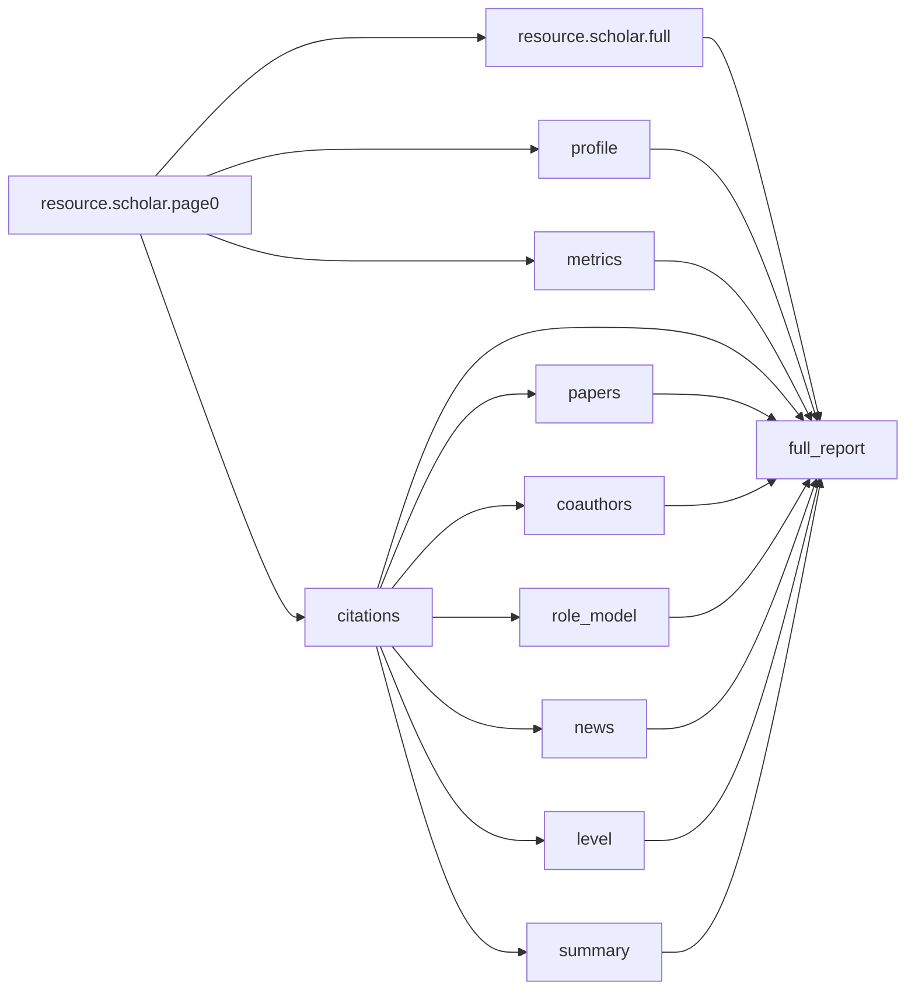
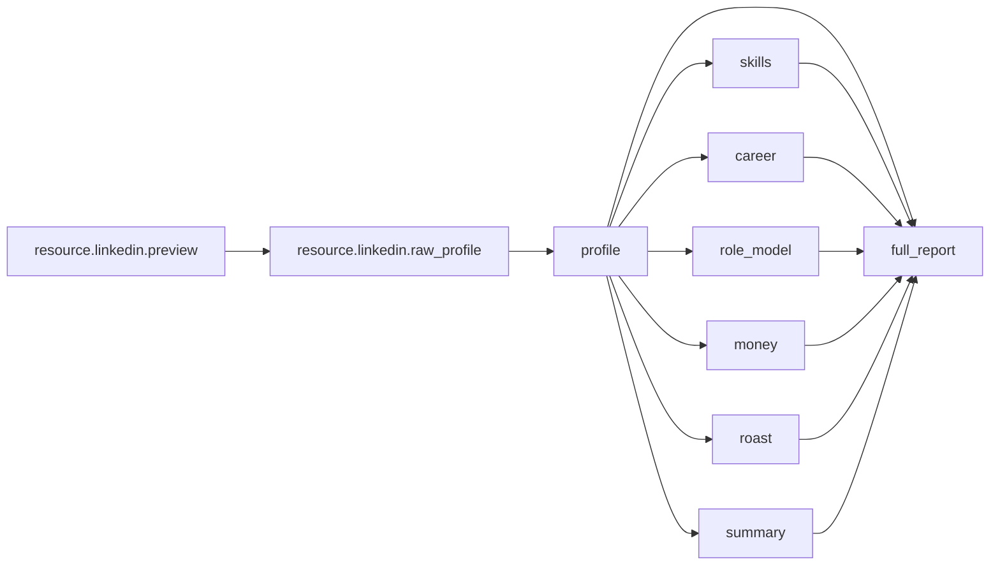

# Analyze DAG（依赖图 / 执行顺序）

本页用于帮助前端/产品理解：为什么会出现 `resource.*`、各卡片的依赖关系（DAG）、以及“结果为什么能更早出来”。

> 说明：对外只通过 Gateway 的 3 个接口（create / status / stream）。前端无需感知内部的资源卡，只需要渲染业务卡（如 `profile/summary/...`）。

---

## 0) 关键概念

- **业务卡（UI cards）**：前端要渲染的卡片，例如 `profile/summary/roast/...`
- **内部卡（internal cards）**：以 `resource.*` 开头的资源获取/结构化，以及 `full_report`
  - `resource.*`：用于拆分计算链路，让依赖它的业务卡更早 `completed`
  - `full_report`：最终聚合结果（同时也是跨 job 缓存的落点）
- **DAG 调度**：每张卡都有 `depends_on`，依赖满足后才会从 `pending → ready → running`

前端建议：
- 渲染时忽略 `resource.*` 与 `full_report`（它们可能会发 `card.progress` / `card.completed`，但不是 UI 卡）
- UI 只关注：`card.prefill`（可选）/ `card.delta`（可选）/ `card.completed`（最终）/ `card.failed`

---

## 1) GitHub（github）

```mermaid
flowchart LR
  A[resource.github.profile] --> P[profile]
  B[resource.github.preview] --> R[repos]
  B --> RM[role_model]
  B --> Ro[roast]
  B --> S[summary]
  B --> C[resource.github.data]
  C --> Act[activity]
  C --> BestPR[resource.github.best_pr (optional)]
  BestPR -. updates .-> R
  P --> FR[full_report]
  Act --> FR
  R --> FR
  RM --> FR
  Ro --> FR
  S --> FR
```

含义：
- `resource.github.profile`：只抓取 GitHub 基础身份信息（尽快产出 `profile`，保证 10s 首屏）
- `resource.github.preview`：fast-first 的 repo 列表预览（会尽早对 `repos.top_projects` 发送 `card.append`）
- `resource.github.data`：抓取/聚合 GitHub 原始数据（activity/full_report 的主要数据来源；**延后到 preview 之后运行**，允许长尾）
- **LLM 生成改在 UI cards 内部执行**：`role_model/roast/summary` 这些卡本身会调用 LLM，因此 `card.delta` 会挂在对应的 UI card 上（而不是挂在内部 `resource.*` 上）
- `role_model/roast/summary` 默认仅依赖 preview（不等待 `resource.github.data`），目标是把 AI 卡也纳入“10 秒内交付 80% 感知价值”的首屏窗口。
- `repos` 的 `most_valuable_pull_request` 在 10s 预算内可能先用启发式降级产出；若发生 LLM 超时，后端会在后台排队一个内部卡（`resource.github.best_pr`）继续慢慢补齐，并用新的 `card.completed` 覆盖更新 repos。

---

## 2) Scholar（scholar）



含义：
- `resource.scholar.page0`：10s 首屏关键路径（只抓 page0/少量论文；尽早产出 profile/metrics/citations，并对 `papers.items` 做 `card.append` 增量预览）
- `resource.scholar.full`：后台补齐（抓更多页/论文并 warm cache；不阻塞首屏）
- **LLM/news/level/summary 改为 UI cards 自己执行**：`role_model/news/level/summary` 会在各自卡片内调用 LLM/外部检索，从而可以分别流式输出（`card.delta`）
- 体验优化：page0 抓取一旦解析出 profile/metrics，会用 `card.completed` 预填充对应 UI cards（`meta.partial=true`），无需等待全量页。

---

## 3) LinkedIn（linkedin）



含义：
- `resource.linkedin.preview`：快速解析/规范化输入并立即输出 degraded profile（不做 Apify 抓取）
- `resource.linkedin.raw_profile`：长尾的真实抓取（Apify/第三方），完成后再把 `profile` 卡填满
- **AI enrich 改为 UI cards 自己执行**：`skills/career/money/roast/summary` 等卡片内部会调用 LLM，因此会在对应 UI card 上产生 `card.delta`

---
